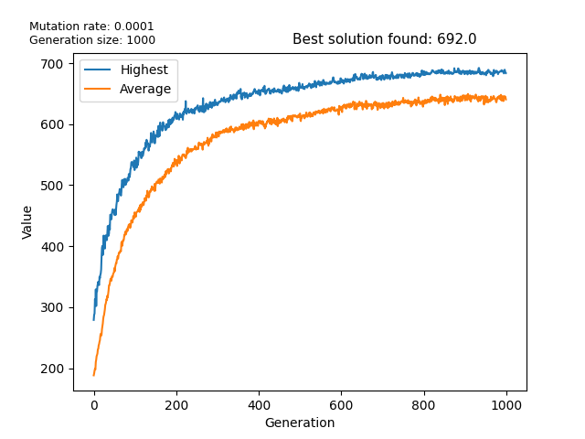

#GeneticAlgorithm-Knapsack
Goal: Given 400 objects of varying weight and value, find the highest value combination of items that fits under a 500LB total weight limit. 

Since this 'knapsack problem' is NP-hard and would take several lifetimes to find the optimal solution, a genetic algorithm is used to find an approximate solution by gradually improving over generations, similar to DNA.

A genetic algorithm evaluates hundreds of different combinations of items, and combinations under the maximum weight limit are combined to make a new generation. 
Over enough generations, the value of combinations increases, finding an approximate solution.

#Screenshots

#Installation
1. Adjust input file (Input-Items.txt) as desired before running.
2. >pip install -r requirements.txt
3. >python knapsack.py

#Limitations
* Single-threaded
  
        Since tens of thousands of combinations have to be evaluated, it takes 5-10 minutes to run. 
        Concurrency would cut that down immensely, and would be relatively easy to implement, 
        since no syncing between threads would be necessary.